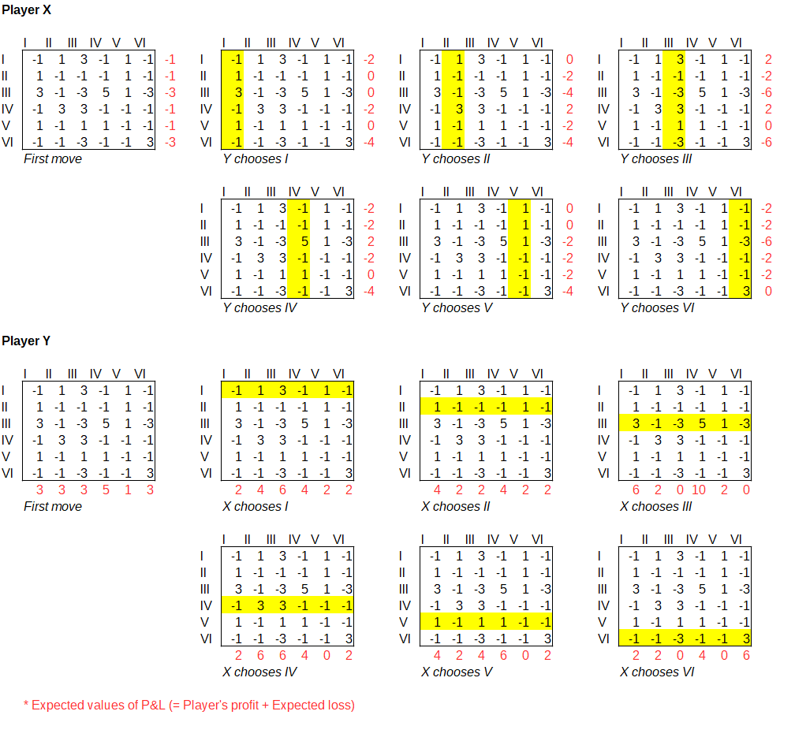
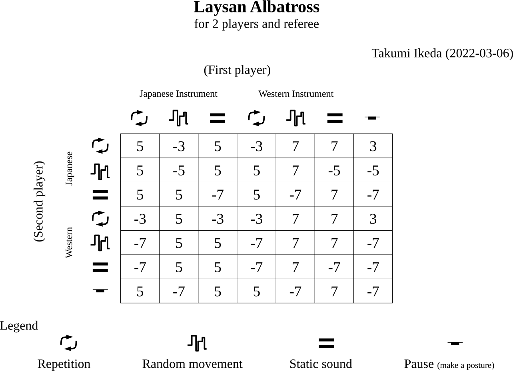

## Introduction

Iannis Xenakis' orchestral work Duel (1959) is a "game for 56 musicians divided into two orchestras with two conductors" based on the Game theory.[^1] The players of the game are two conductors, and the orchestras play "tactics," which conductors' choice. Tactics correspond to individual cards in a card game. The two conductors take turns choosing tactics, like playing cards, to achieve a high score. The orchestral music is generated as a byproduct of the game. So, its performance is intended to realize the game, not music. In his "Formalized Music," Xenakis called music controlled by other elements that have nothing to do with music, like the Game theory "Heteronomous music. Its synonym is "Autonomous music" or "music for music.

The tactics are not randomly selected. The process of competition by the conductors automatically limits the tactics that conductors can choose. The limitation of possibility causes certain tendencies in the music that is generated. Xenakis examined the desirability of sound combinations in creating game rules, defined as a payoff (game) matrix. Therefore, the execution of the game automatically generates music that he generally finds favorable. Also, different music is generated each time the game is played. In Ikeda's view, this is a humanized version of algorithmic composition usually realized by computers.

Xenakis' Game theory works, Duel, Stratégie (1962), and Linaia-Agon (1972) are said to be rarely performed due to the complexity of their preparation. Linaia-Agon, in particular, requires the performers to choose their own tactics while playing an extremely difficult score, forcing them to decide what to play in advance, which is a realistic approach. Ikeda believes that the lack of these performance opportunities has led to a lack of validation of the game itself. After receiving a proposal from Professor Iannis Zannos for a remote performance based on Duel, Ikeda examined the game matrix and discovered a problem. He then created a new game matrix, which was first performed live by two improvisers and Ikeda's own referee. He then created a game program with the new game matrix using Supercollider and performed a duo performance with Zannos.

[^1]: https://brahms.ircam.fr/en/works/work/12797/

## How to play Duel

### Duel is a Sequential Game

The Game theory classifies games into two main categories, Sequential Games and Simultaneous Games, based on when players express their intentions. An example of a Simultaneous Game is Rock-paper-scissors, and an example of a Sequential game is Tic-tac-toe. According to the performance notes of Duel, the tactics should be presented alternately by the two conductors. So that the music is uninterrupted. Therefore, Duel is a Sequential Game.

### Duel is a Perfect information game

The Game theory also distinguishes between games based on whether or not all information about the game is disclosed. It is a perfect information game if the player can get all the information. The performance notes of Duel are not very clear, but Duel is a perfect information game if the conductor plays while watching the game matrix. Working backward from the idea of using Game theory as an aid to generate music to the composer's liking automatically, the conductor should play while looking at the game matrix.

According to the above two points, there is no point in decision-making based on a lottery, as Xenakis wrote in his performance notes.

> En fait, toutes ces façons constituent des situations conflictuelles "dégénérées".

### The game matrix

What is peculiar in the score of Duel is the 6x6 game matrix shown on page 2. In the Game theory, this is called the payoff matrix generally. The matrix of Duel is made up of positive or negative integers. In general, a payoff matrix is written as follows.

<table>
	<colgroup></colgroup>
	<tr>
		<td colspan=2 rowspan=2></td>
		<td colspan=3 align="center">Y</td>
		</tr>
	<tr>
		<td>Rock</td>
		<td>Paper</td>
		<td>Scissors</td>
	</tr>
	<tr>
		<td rowspan=3>X</td>
		<td>Rock</td>
		<td>0 : 0</td>
		<td>-1 : 1</td>
		<td>1 : -1</td>
	</tr>
	<tr>
		<td>Paper</td>
		<td>1 : -1</td>
		<td>0 : 0</td>
		<td>-1 : 1</td>
	</tr>
	<tr>
		<td>Scissors</td>
		<td>-1 : 1</td>
		<td>1 : -1</td>
		<td>0 : 0</td>
	</tr>
</table>

Of the number pairs, the left shows Player X's profit and loss (P&L), and the right shows Player Y's P&L. The sum of the P&Ls of X and Y is always zero. Therefore, Rock-paper-scissors is a zero-sum game. Since rock-paper-scissors is a zero-sum game, its payoff matrix can be succinctly expressed as follows.

<table>
	<colgroup></colgroup>
	<tr>
		<td colspan=2 rowspan=2></td>
		<td colspan=3 align="center">Y</td>
		</tr>
	<tr>
		<td>Rock</td>
		<td>Paper</td>
		<td>Scissors</td>
	</tr>
	<tr>
		<td rowspan=3>X</td>
		<td>Rock</td>
		<td>0</td>
		<td>-1</td>
		<td>1 </td>
	</tr>
	<tr>
		<td>Paper</td>
		<td>1</td>
		<td>0</td>
		<td>-1 </td>
	</tr>
	<tr>
		<td>Scissors</td>
		<td>-1</td>
		<td>1</td>
		<td>0 </td>
	</tr>
</table>

In the above matrix, a positive number is a profit for X, and at the same time, it means a loss for Y. A negative number is a loss for X, and at the same time, it means a profit for Y. The notation above is the same as for the game matrix of Duel. So, Duel is also a zero-sum game. Let's look at the game matrix of Duel. Positive signs are omitted in the following matrix.

<table>
	<colgroup></colgroup>
	<colgroup></colgroup>
	<colgroup></colgroup>
	<colgroup></colgroup>
	<tr>
		<td colspan=2 rowspan=2></td>
		<td colspan=6 align="center">Y</td>
		</tr>
	<tr>
		<td>I</td>
		<td>II</td>
		<td>III</td>
		<td>IV</td>
		<td>V</td>
		<td>VI</td>
	</tr>
	<tr>
		<td rowspan=6>X</td>
		<td>I</td>
		<td>-1</td>
		<td>1</td>
		<td>3</td>
		<td>-1</td>
		<td>1</td>
		<td>-1</td>
	</tr>
	<tr>
		<td>II</td>
		<td>1</td>
		<td>-1</td>
		<td>-1</td>
		<td>-1</td>
		<td>1</td>
		<td>-1</td>
	</tr>
	<tr>
		<td>III</td>
		<td>3</td>
		<td>-1</td>
		<td>-3</td>
		<td>5</td>
		<td>1</td>
		<td>-3</td>
	</tr>
	<tr>
		<td>IV</td>
		<td>-1</td>
		<td>3</td>
		<td>3</td>
		<td>-1</td>
		<td>-1</td>
		<td>-1</td>
	</tr>
	<tr>
		<td>V</td>
		<td>1</td>
		<td>-1</td>
		<td>1</td>
		<td>1</td>
		<td>-1</td>
		<td>-1</td>
	</tr>
	<tr>
		<td>VI</td>
		<td>-1</td>
		<td>-1</td>
		<td>-3</td>
		<td>-1</td>
		<td>-1</td>
		<td>3</td>
	</tr>
</table>

In practice, a payoff matrix is an analysis tool for simultaneous games. Sequential games must be analyzed using a game tree because the player's situation is not constant but changes each time depending on the opponent's moves. Xenakis treats the payoff matrix itself as a kind of game board.

### How do the players get points?

Let's take a look at how scoring occurs in a Duel performance. The point is determined by the combination of X tactics and Y tactics. The point is the number at the intersection of X and Y tactics in the game matrix. If X chooses strategy VI and Y also chooses strategy VI, 3 points arise. Positive numbers will be X's score. Negative numbers are multiplied by -1 to yield a score for Y. As noted above, Duel is a Sequential Game. Only one strategy, X or Y, exists for the first move. Therefore, we must note that the first move does not produce points. If Y chooses Tactic IV, X's next move will certainly be Tactic III because X will gain 5 points.

Xenakis shows the probability that conductors should choose each strategy after complex calculations. Nevertheless, there is one value of "+5" in the game matrix of Duel. Therefore, it is practically impossible for conductor Y to choose tactic IV because the next turn of conductor X would pull away 5 points at once. The presence of a "+5" when there are only "+/-1" or "+/-3" in the other cells of the game matrix is a disadvantage for Y.

A strategy that seeks to minimize one's losses is called a "minimax strategy" in the Game theory. In a zero-sum game, the strategy would reduce the opponent's profit as much as possible because the opponent's gain is your loss. If conductor Y adopts a minimax strategy, the likelihood of choosing Tactic IV seems quite small. Or perhaps, after guessing a few moves ahead, conductor Y will have the advantage. To guess several moves ahead, it is necessary to analyze the "game tree," which is a tree structure of all the situations that diverge according to the alternating moves. Ikeda is not an expert in game theory and does not analyze game trees. Instead, Ikeda created a simulation program.

### Simulations of Duel

#### 1. The maximum profit strategy

How does the simulation program choose its tactics? Ikeda set up two strategies: the "maximum profit" and the "minimax strategy. The maximum profit strategy chooses the tactic with the most points to be gained in the next move. Specifically, the rows or columns are cut out of the matrix according to the previous opponent's strategy to find out where the maximum profit is. In many cases, more than one tactic maximizes profit, so it randomly chooses one of them. The first move is chosen equally randomly among the six tactics because the maximum profit strategy cannot determine the first move. When the game reaches the pre-determined number of moves, the number of moves multiplied by 0.07 is added to X's score and subtracted from Y's score according to Xenakis' instructions.

> at the end of game, at the final score, conductor Y should give 0.07m points to conductor X, where m is the total number of moves. (Formalized Music, p.121)

After 10,000 trials of the game with 21 moves (both X and Y can score equally 10 times since no points are scored on the first move), X's winning rate was 100%, whether the first move was made by X or by Y. When the combination of tactics used was tabulated, differences were observed depending on the first move. The following is the case where the first move is X.

<table>
	<tr>
		<td></td>
		<td>I</td>
		<td>II</td>
		<td>III</td>
		<td>IV</td>
		<td>V</td>
		<td>VI</td>
	</tr>
	<tr>
		<td>I</td>
		<td>7151</td>
		<td>0</td>
		<td>20030</td>
		<td>7160</td>
		<td>2058</td>
		<td>7156</td>
	</tr>
	<tr>
		<td>II</td>
		<td>0</td>
		<td>864</td>
		<td>901</td>
		<td>844</td>
		<td>1944</td>
		<td>821</td>
	</tr>
	<tr>
		<td>III</td>
		<td>12389</td>
		<td>0</td>
		<td>12992</td>
		<td>13129</td>
		<td>1931</td>
		<td>13391</td>
	</tr>
	<tr>
		<td>IV</td>
		<td>5238</td>
		<td>1401</td>
		<td>19988</td>
		<td>5125</td>
		<td>5377</td>
		<td>5213</td>
	</tr>
	<tr>
		<td>V</td>
		<td>0</td>
		<td>537</td>
		<td>0</td>
		<td>0</td>
		<td>556</td>
		<td>549</td>
	</tr>
	<tr>
		<td>VI</td>
		<td>0</td>
		<td>0</td>
		<td>26125</td>
		<td>0</td>
		<td>0</td>
		<td>27130</td>
	</tr>
</table>

The following is the case where the first move is Y. Without a detailed analysis, X does not choose tactic V.

<table>
	<tr>
		<td></td>
		<td>I</td>
		<td>II</td>
		<td>III</td>
		<td>IV</td>
		<td>V</td>
		<td>VI</td>
	</tr>
	<tr>
		<td>I</td>
		<td>7115</td>
		<td>0</td>
		<td>19182</td>
		<td>7124</td>
		<td>2235</td>
		<td>7178</td>
	</tr>
	<tr>
		<td>II</td>
		<td>0</td>
		<td>523</td>
		<td>525</td>
		<td>541</td>
		<td>2121</td>
		<td>532</td>
	</tr>
	<tr>
		<td>III</td>
		<td>12902</td>
		<td>0</td>
		<td>14172</td>
		<td>13404</td>
		<td>2259</td>
		<td>14393</td>
	</tr>
	<tr>
		<td>IV</td>
		<td>5411</td>
		<td>2185</td>
		<td>19357</td>
		<td>5401</td>
		<td>5444</td>
		<td>5286</td>
	</tr>
	<tr>
		<td>V</td>
		<td>0</td>
		<td>0</td>
		<td>0</td>
		<td>0</td>
		<td>0</td>
		<td>0</td>
	</tr>
	<tr>
		<td>VI</td>
		<td>0</td>
		<td>0</td>
		<td>26355</td>
		<td>0</td>
		<td>0</td>
		<td>26355</td>
	</tr>
</table>

#### 2. The minimax strategy

In the minimax strategy, the profit made in the next move is added to the maximum profit the opponent can make in the subsequent move, i.e., the maximum loss you can suffer. The tactic to choose is the one that results in the least loss. In the matrix, X adds the minimum value of the row containing the tactic to the number of points X would gain from the tactic. Then X selects from the row whose value is the largest. Y adds the maximum value of the column containing the tactic to the number of points Y would gain from the tactic. Then Y selects from the column whose value is the smallest. The above calculations are shown in the following table. For example, if Y chooses Tactic I in the previous move, X can gain 3 points by Tactic III. However, Y can choose either Tactic III or VI in the next move to win back 3 points. Therefore, the expected value of profit and loss (P&L) is 0. Looking more closely at the table, the expected value of P&L, indicated by the red numbers, has both positive and negative numbers in the X table, but only 0 or positive numbers in the Y table. Since a positive number is a loss for Y, Duel is expected to be a tough game for Y.

Using the minimax strategy, 10,000 trials were made for each case, X first, Y first, and X again had a 100% win rate. A tally of the tactics used is as follows: case X first.

<table>
	<tr>
		<td></td>
		<td>I</td>
		<td>II</td>
		<td>III</td>
		<td>IV</td>
		<td>V</td>
		<td>VI</td>
	</tr>
	<tr>
		<td>I</td>
		<td>10613</td>
		<td>0</td>
		<td>8431</td>
		<td>0</td>
		<td>33749</td>
		<td>10318</td>
	</tr>
	<tr>
		<td>II</td>
		<td>3604</td>
		<td>6750</td>
		<td>6765</td>
		<td>0</td>
		<td>30416</td>
		<td>6809</td>
	</tr>
	<tr>
		<td>III</td>
		<td>3509</td>
		<td>0</td>
		<td>1558</td>
		<td>0</td>
		<td>0</td>
		<td>1583</td>
	</tr>
	<tr>
		<td>IV</td>
		<td>0</td>
		<td>6750</td>
		<td>8390</td>
		<td>0</td>
		<td>16092</td>
		<td>0</td>
	</tr>
	<tr>
		<td>V</td>
		<td>3500</td>
		<td>0</td>
		<td>0</td>
		<td>0</td>
		<td>5648</td>
		<td>0</td>
	</tr>
	<tr>
		<td>VI</td>
		<td>0</td>
		<td>0</td>
		<td>8498</td>
		<td>0</td>
		<td>8307</td>
		<td>18710</td>
	</tr>
</table>

And Y first. As Ikeda pointed out before, in both cases Y does not use tactic IV. In the minimax strategy, the number of unused tactical combinations is slightly greater than the maximum profit strategy. The existence of unused tactical combinations means that the situation is under control, whether or not Xenakis planned. Random choices such as free improvisation would not create such a controlled situation.

<table>
	<tr>
		<td></td>
		<td>I</td>
		<td>II</td>
		<td>III</td>
		<td>IV</td>
		<td>V</td>
		<td>VI</td>
	</tr>
	<tr>
		<td>I</td>
		<td>11001</td>
		<td>0</td>
		<td>7954</td>
		<td>0</td>
		<td>36078</td>
		<td>11101</td>
	</tr>
	<tr>
		<td>II</td>
		<td>3280</td>
		<td>6967</td>
		<td>7092</td>
		<td>0</td>
		<td>31783</td>
		<td>7024</td>
	</tr>
	<tr>
		<td>III</td>
		<td>3317</td>
		<td>0</td>
		<td>1653</td>
		<td>0</td>
		<td>0</td>
		<td>1664</td>
	</tr>
	<tr>
		<td>IV</td>
		<td>0</td>
		<td>6297</td>
		<td>8017</td>
		<td>0</td>
		<td>14314</td>
		<td>0</td>
	</tr>
	<tr>
		<td>V</td>
		<td>3306</td>
		<td>0</td>
		<td>0</td>
		<td>0</td>
		<td>3306</td>
		<td>0</td>
	</tr>
	<tr>
		<td>VI</td>
		<td>0</td>
		<td>0</td>
		<td>9022</td>
		<td>0</td>
		<td>8901</td>
		<td>17923</td>
	</tr>
</table>

Nevertheless, as long as the objective is to win the game, there is a problem with one side being shown a 100% win rate. How can we ensure that the game is fair? After all, Ikeda believes that the easiest way to keep the game playable without making it more complicated is to rearrange the game matrix. Doing so would bring Xenakis' plan closer to its original form.

### New 7x7 matrix and new work based on it

Ikeda wrote a new game theory piece for two improvisers, one of whom played the violin, one the trumpet, and both could also play the shakuhachi. The three basic tactics are Repetition, Random movement, and Static sound. Ikeda was inspired by Conway's "Life Game" to configure these three types of sound figures and thought they would be relatively easy to distinguish. Six different tactics are achieved by playing three tactics on two different instruments, Japanese and Western. Seven tactics are possible by adding the same "silence" as in Duel. However, in this work, the performer must make some posture without making a sound. Finally, the work requires a 7x7 game matrix. The Laysan Albatross, the bird that gave this work its title, is known for its intricate and interesting courtship dance; Ikeda saw a YouTube video of two birds dancing, which resembled a Duel performance, and decided to use it as the title of the work.

How did Ikeda obtain the new game matrix? As a matter of fact, it was obtained by chance by continually testing randomly generated matrices. However, this matrix also had some problems when examined again. The conditions for X's win rate to become 50-60% are the followings. Both players adopt the maximum profit strategy instead of the minimax strategy. The first attacker is always conductor Y of Duel. The total number of moves is an even number of about 30, so conductor X scores one more time than Y. The fact that the total number of moves is even is a careless mistake by Ikeda. The number of occurrences of tactical combinations varies. However, all combinations appear.

### Creation of game matrices using a simple Genetic Algorithm

Ikeda attempted to create a game matrix based on Duel's game matrix using a simplified Genetic Algorithm (GA). Adding +1 or -1 to any one cell of the 6x6 matrix yields 72 variants. About 100 games consisting of a certain number of moves are played with all variants, and the results are tallied. Sort the aggregate results by multiple criteria and create 72 variants of the next generation based on the best matrix. This process is repeated about 30 times. The four conditions used for sorting are the presence of tactics not used by X or Y (0 is superior), the deviation in X's win rate (less is better), the number of unused tactical combinations (less is better), and the deviation in the number of unused tactical combinations (less is better). Four game patterns are played for one variant, depending on whether the first attack is X or Y and whether it is a maximum profit or minimax strategy. The variation in results from each pattern is evaluated as the deviation, the less deviation between the four patterns, the fairer the game. The following game matrix was thus obtained.

<table>
	<colgroup span="8"></colgroup>
	<tr>
		<td colspan=2 rowspan=2> </td>
		<td colspan=6 align="center">Y</td>
		</tr>
	<tr>
		<td>I</td>
		<td>II</td>
		<td>III</td>
		<td>IV</td>
		<td>V</td>
		<td>VI</td>
	</tr>
	<tr>
		<td rowspan=6>X</td>
		<td>I</td>
		<td>-1</td>
		<td>1</td>
		<td>3</td>
		<td>-1</td>
		<td>1</td>
		<td>-1</td>
	</tr>
	<tr>
		<td>II</td>
		<td>1</td>
		<td>-1</td>
		<td>3</td>
		<td>-1</td>
		<td>1</td>
		<td>-1</td>
	</tr>
	<tr>
		<td>III</td>
		<td>2</td>
		<td>-1</td>
		<td>-3</td>
		<td>3</td>
		<td>1</td>
		<td>-3</td>
	</tr>
	<tr>
		<td>IV</td>
		<td>-1</td>
		<td>3</td>
		<td>1</td>
		<td>-2</td>
		<td>-3</td>
		<td>-1</td>
	</tr>
	<tr>
		<td>V</td>
		<td>-1</td>
		<td>1</td>
		<td>2</td>
		<td>1</td>
		<td>1</td>
		<td>-1</td>
	</tr>
	<tr>
		<td>VI</td>
		<td>-2</td>
		<td>-2</td>
		<td>-5</td>
		<td>1</td>
		<td>-2</td>
		<td>3</td>
	</tr>
</table>

When Ikeda simulated four patterns of the game in the game matrix above, the cell or tactical combination used was about 22 to 23, and the win rate for X was generally between 40-60%. Nevertheless, the strategies that players may adopt will be different than a mere maximum profit strategy or a mere minimax strategy, so we will have to play to see if this is truly a fair game.
